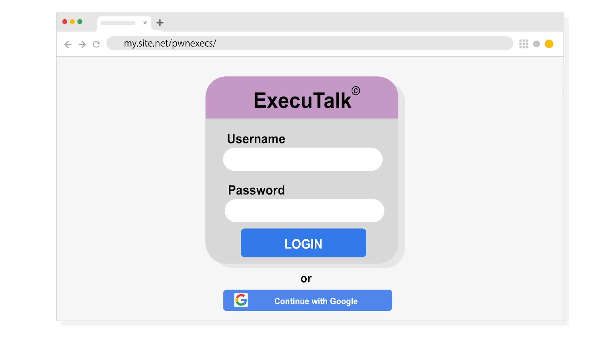

# Incident Response: Spear-Phishing & Social Engineering Analysis

## 📌 Project Description
As a Security Analyst for an investment firm (Imaginary Bank), I was tasked with investigating a suspicious email forwarded by the Chief Financial Officer (CFO). The email appeared to be an internal communication from the board of directors urging the executive to install a new collaboration software called "ExecuTalk." This project breaks down the forensic analysis of the email to identify Indicators of Compromise (IoCs), expose the social engineering tactics used by the threat actor, and determine the necessary containment actions.

---

## 📧 Phase 1: Email Header Analysis
The first step in investigating a suspicious email is analyzing the header. Threat actors often try to spoof addresses, but the metadata usually reveals their true origin.

**Suspicious Email Header:**
> **From:** imaginarybank@gmail.org
> **Sent:** Saturday, December 21, 2019 15:05:05
> **To:** cfo@imaginarybank.com
> **Subject:** RE: You have been added to an ecsecutiv groups

### 🚩 Indicators of Compromise (IoCs):
1. **Domain Mismatch:** Legitimate corporate requests do not come from public or slightly altered domains. The sender used `@gmail.org` instead of the official `@imaginarybank.com` domain.
2. **Spelling and Grammar Errors:** The subject line contains glaring typos ("ecsecutiv groups"), which is highly uncharacteristic of official board-level communications.
3. **Fabricated Thread (RE:):** The subject starts with "RE:" to trick the victim into thinking this is part of an ongoing, legitimate conversation they simply forgot about.

---

## 🎭 Phase 2: Body & Social Engineering Tactics
Threat actors rely on psychological manipulation. The body of the email was crafted to look legitimate while simultaneously inducing panic.

**Email Body Extract:**
> *Conglaturations! You have been added to a collaboration group 'Execs'*
> *Download ExecuTalk to your computer.*
> *Mac® | Windows® | Android™*
> *Your team needs you! This invite will expire in 48 hours, so act fast.*

### 🔍 Deception Tactics Used:
* **Brand Legitimacy:** The attacker used official-looking brand labeling, copyright symbols (©, ™, ®), and download options for major operating systems to make the software appear as an established, cross-platform enterprise tool.
* **Sense of Urgency:** By stating *"Your team needs you! This invite will expire in 48 hours,"* the attacker creates a false sense of urgency, pressuring the executive to act quickly without verifying the request with the IT department.

---

## 🎣 Phase 3: Payload & URL Analysis

Investigating the download options required safely hovering over the links to inspect their destination without executing them. The links redirected to a credential-harvesting login page.

### 🚩 Critical Finding: The Malicious URL
While the login form visually mimics a legitimate enterprise portal (complete with branding and Single Sign-On options like "Continue with Google"), **the primary IoC is the URL itself**. 

The page is hosted on `my.site.net/pwnexecs/`. When accessing internal corporate SaaS services or legitimate third-party applications, the URL should align with the organization's verified domain or the verified vendor's domain. The use of a generic, unverified hosting site clearly indicates that this is a fake landing page designed to capture the CFO's username and password (Credential Harvesting).

---

## 🛡️ Conclusion & Mitigation Strategy
**Action Taken: Quarantine & Alert**
Based on the overwhelming evidence of domain spoofing, social engineering (urgency), and a malicious credential-harvesting URL, this email was classified as a highly targeted **Spear-Phishing attack**. 

The immediate remediation steps included:
1. **Quarantine:** The email was actively blocked and quarantined from the CFO's inbox and globally across the organization's email server to prevent other executives from receiving it.
2. **Security Awareness:** The IoCs (specifically the malicious sender domain and the fake URL) were documented and shared with the Threat Intelligence team. A brief security bulletin was issued to the executive team reminding them to verify unexpected software installation requests directly with the IT helpdesk.
