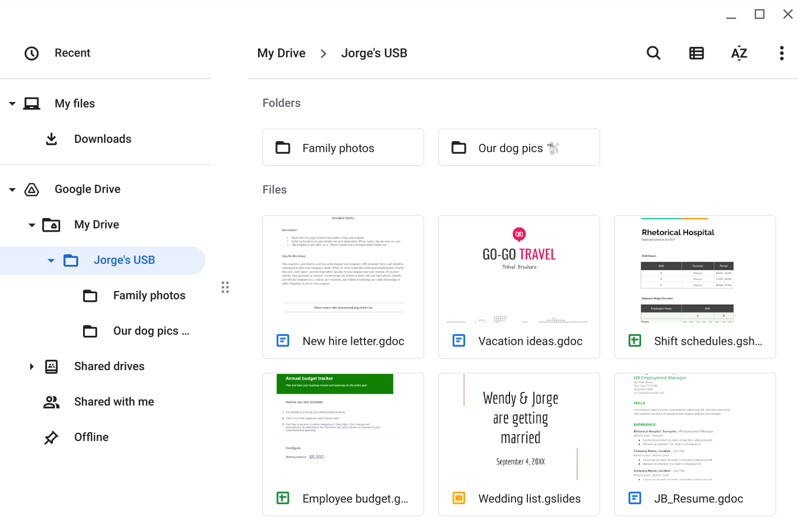

# Incident Response: USB Baiting & Malware Risk Analysis

## 📌 Project Description
During a simulated security incident, I acted as a cybersecurity analyst for Rhetorical Hospital and investigated a suspicious USB flash drive found in the employee parking lot. To safely analyze the artifact without risking network infection, I mounted the drive within an isolated virtual machine (VM) sandbox. This project explores the contents of the drive, analyzes the potential threat actor's mindset, and outlines the technical and operational security controls necessary to mitigate USB baiting attacks.

---

## 📁 1. Drive Contents & PII Exposure

The USB drive contains a highly insecure mixture of personal and work-related files. It holds sensitive corporate documents, including a new hire letter, employee shift schedules, and an employee budget tracker, alongside personal items like family photos, vacation ideas, and a wedding list. Storing Personally Identifiable Information (PII) alongside corporate data is a severe security violation, as it exposes both the employee and the organization to significant privacy risks.

## 🧠 2. The Attacker Mindset
An attacker could leverage the personal information and PII found on this drive to craft highly targeted spear-phishing campaigns against Jorge, his relatives, or hospital staff. Furthermore, this scenario bears the hallmarks of a staged USB baiting attack; an attacker could have intentionally planted these enticing personal files as a distraction while hidden malicious scripts silently establish a backdoor into the hospital's network.

## ⚠️ 3. Risk Analysis & Security Controls
If an unsuspecting employee had connected this device directly to a hospital workstation, it could have deployed malicious software such as ransomware, rootkits, or Trojans. A threat actor discovering a legitimate, lost drive like this would gain unrestricted access to sensitive corporate schedules and employee data, which could be weaponized to facilitate further physical or digital breaches. 

To mitigate these risks, the hospital must implement the following controls:
* **Technical Controls:** Disable USB auto-run features across the domain and utilize Endpoint Detection and Response (EDR) or Group Policy to block unauthorized removable media from mounting. 
* **Operational & Managerial Controls:** Enforce strict data handling policies that prohibit mixing personal and corporate data, and mandate recurring security awareness training to educate staff on the severe dangers of plugging in unknown devices.
