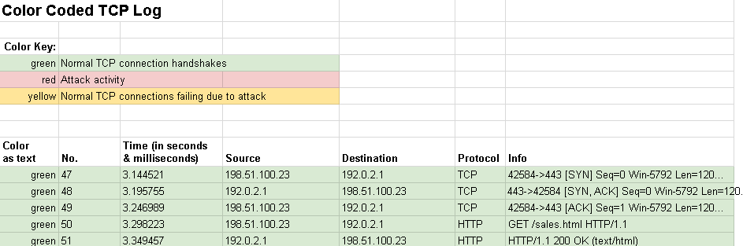
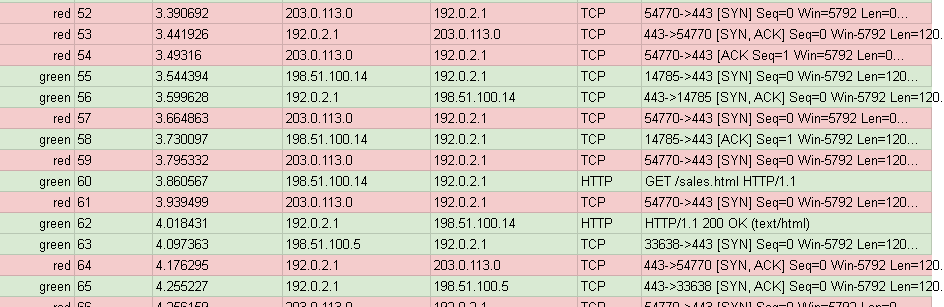

# Cybersecurity Incident Report: DNS and ICMP Incident Analysis

## Section 1: Identify the type of attack that may have caused this network interruption

**One potential explanation for the website's connection timeout error message is:**
The web server is experiencing a Denial of Service (DoS) attack, specifically a **SYN Flood attack**. The server's resources are being completely exhausted by malicious connection requests, preventing legitimate employees and customers from accessing the website.

**The logs show that:**
The server (`192.0.2.1`) is receiving an abnormally high continuous stream of TCP SYN packets from a single unknown IP address (`203.0.113.0`) targeting port 443. Unlike normal traffic (like the successful connection from `198.51.100.23` seen earlier in the logs), these malicious requests never complete the handshake, leaving the server waiting indefinitely.

**This event could be:**
A targeted Denial of Service (DoS) attack aimed at disrupting business operations by taking the company's travel website offline.

---

## Section 2: Explain how the attack is causing the website to malfunction

**When website visitors try to establish a connection with the web server, a three-way handshake occurs using the TCP protocol. Explain the three steps of the handshake:**
1. **SYN (Synchronize):** The client sends a SYN packet to the server requesting to establish a connection.
2. **SYN-ACK (Synchronize-Acknowledge):** The server receives the request, allocates resources for the connection, and replies with a SYN-ACK packet to acknowledge the request.
3. **ACK (Acknowledge):** The client receives the SYN-ACK and sends an ACK packet back to the server to confirm. The connection is now established, and data (like HTTP requests) can flow.

**Explain what happens when a malicious actor sends a large number of SYN packets all at once:**
The attacker sends thousands of SYN requests to the server but intentionally ignores the server's SYN-ACK responses (or uses a spoofed IP address so the responses go nowhere). The server leaves all these half-open connections in its backlog queue, waiting for the final ACK that never arrives. 

**Explain what the logs indicate and how that affects the server:**
The logs show a relentless flood of SYN requests from `203.0.113.0`. Because the server is allocating memory and processing power to keep these half-open connections alive waiting for the final step of the handshake, its connection queue quickly fills up to maximum capacity. Once the queue is full, the server drops any new, legitimate connection requests (like those from the travel agency's employees), resulting in the "Connection Timeout" error.

---

## Evidence and Traffic Analysis

### 1. Normal Traffic Pattern
Before the incident, the logs show legitimate users successfully completing the TCP 3-way handshake (`SYN`, `SYN-ACK`, `ACK`) and requesting the sales webpage:

### 2. Attack Traffic Pattern (SYN Flood)
During the incident, the logs indicate a flood of `SYN` requests originating from the attacker's IP (`203.0.113.0`). The absence of `ACK` packets from this IP confirms the malicious intent to exhaust server resources:

### 📎 Attachments
* [Download the full Wireshark TCP log (Excel)](HTTP-log.xlsx)
