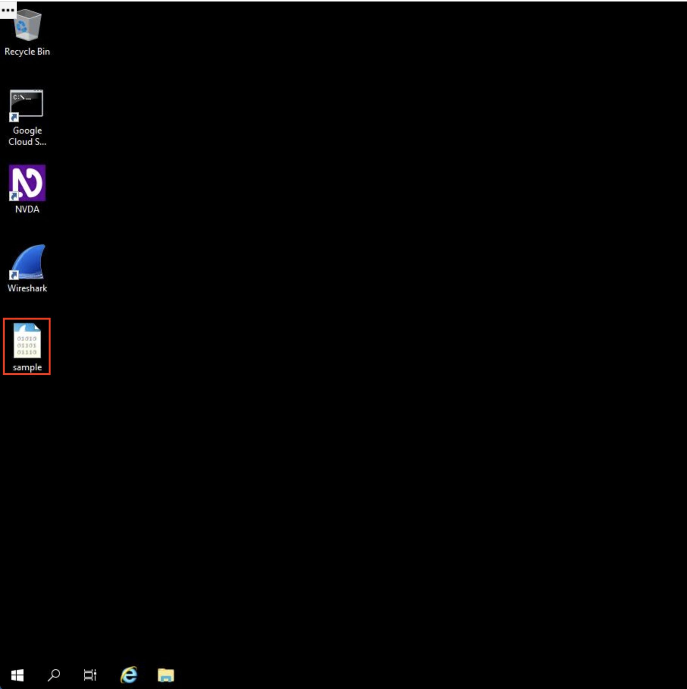
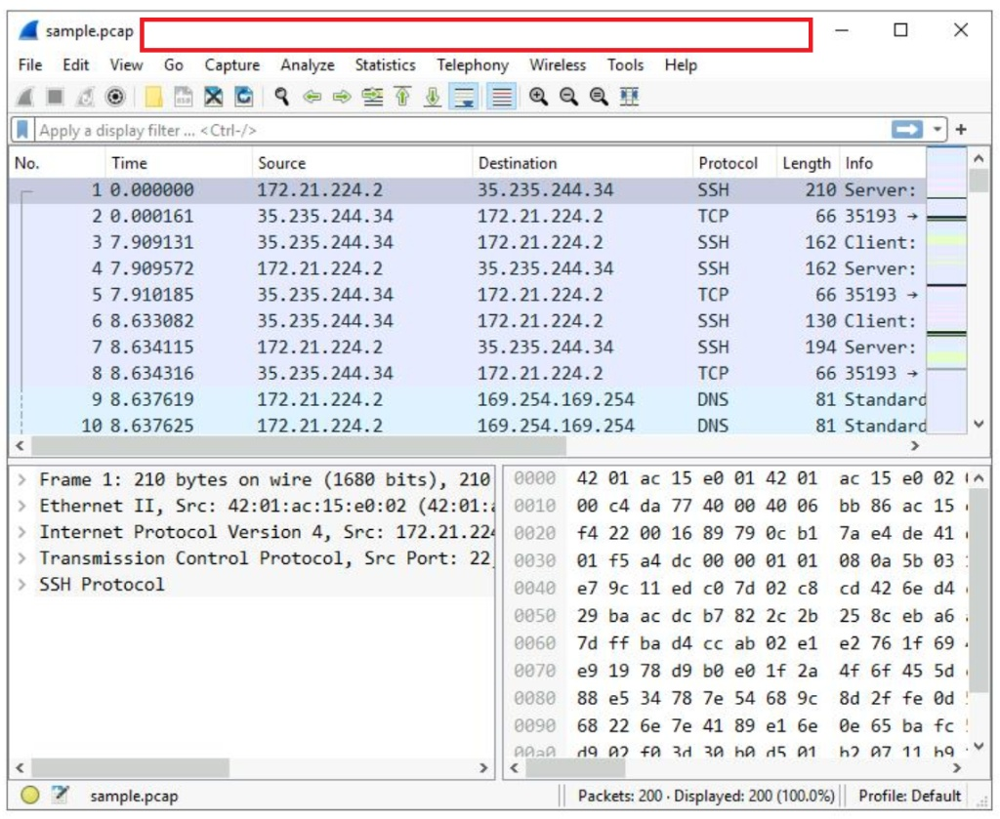
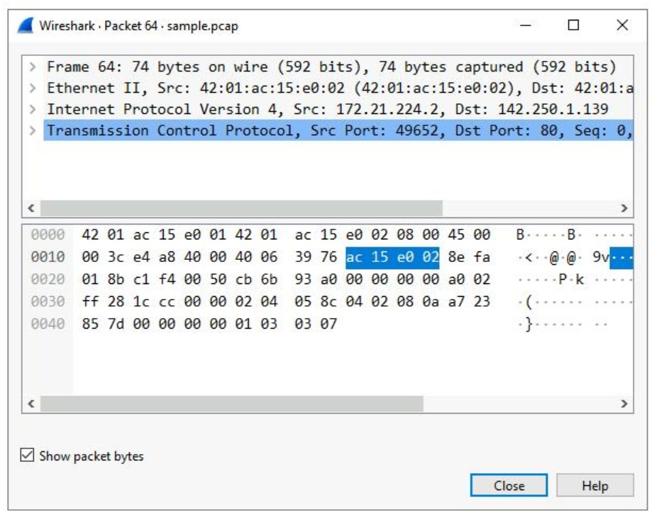
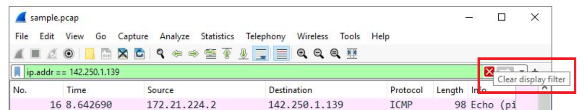

# Network Traffic Analysis & Packet Sniffing with Wireshark


## 📌 Project Description
As a Security Analyst, monitoring and interpreting network communications is essential for detecting anomalies, unauthorized access, and malware signatures. In this project, I utilized **Wireshark**, an industry-standard graphical network protocol analyzer, to inspect a network packet capture file (`.pcap`). The objective of this lab was to dissect network traffic, identify specific source and destination IPs, examine underlying protocols (ICMP, TCP, UDP, DNS), and extract raw payload text to understand the exact nature of the web session.

---

## 📂 Phase 1: Packet Capture Exploration
The investigation began by opening the `sample.pcap` file. Analyzing raw packet data requires understanding the high-level visual cues Wireshark provides.



Once loaded, Wireshark categorizes the traffic using coloring rules. For example, light blue indicates DNS traffic, while light green indicates TCP/HTTP protocols. The main interface provides a summary of crucial packet properties:
* **Time:** The timestamp of the packet capture.
* **Source & Destination:** The originating and receiving IP addresses.
* **Protocol:** The application or transport protocol used (e.g., ICMP for Echo/Ping requests).



---

## 🔬 Phase 2: Deep Packet Inspection (OSI Model Breakdown)
To understand the anatomy of a network packet, I isolated a specific TCP communication and performed a Deep Packet Inspection (DPI) by expanding the protocol subtrees. This process mirrors the layers of the OSI/TCP-IP model.



**Inspection Breakdown:**
1. **Frame:** Evaluated the overall data link frame, revealing a frame length of 54 bytes.
2. **Ethernet II:** Identified the physical MAC addresses of the source and destination hardware.
3. **Internet Protocol Version 4 (IPv4):** Confirmed the logical routing. The destination IP was `169.254.169.254`, the Time to Live (TTL) was set to 64, and the header length was 20 bytes.
4. **Transmission Control Protocol (TCP):** Analyzed the transport layer, identifying the destination port as **Port 80**, standard for unencrypted HTTP web traffic. I also reviewed the TCP Flags to determine the state of the connection handshake.

---

## 🎯 Phase 3: Traffic Filtering & Querying
Network captures can contain millions of packets. To isolate malicious or specific administrative traffic, I applied specialized display filters using Wireshark's query syntax.



### 1. Filtering by IP and MAC Addresses
To isolate a specific host's behavior, I filtered the traffic targeting a specific machine and physical interface:
```wireshark
ip.src == 142.250.1.139
ip.dst == 142.250.1.139
eth.addr == 42:01:ac:15:e0:02
```
*Result: This narrowed down the vast capture file to only show the TCP packets strictly associated with the target hardware's MAC address.*

### 2. DNS Protocol Analysis (UDP)
To investigate which websites the user was attempting to visit, I filtered for Domain Name System (DNS) traffic, which operates on UDP Port 53.
```wireshark
udp.port == 53
```
*Result: By expanding the `Domain Name System (query)` subtree, I discovered a request for `opensource.google.com`. Expanding the `Answers` section revealed that the DNS server successfully resolved this domain to the IP address `142.250.1.139`.*

### 3. Payload Text Extraction
Finally, I needed to identify if specific command-line tools were used to make the web requests. I filtered the TCP traffic to search for cleartext payload data containing the word "curl".
```wireshark
tcp contains "curl"
```
*Result: This powerful filter instantly located the exact packets where the `curl` command-line utility was used to fetch the web page, verifying the method of the HTTP request.*

---

## 📝 Summary & Security Findings
Through this hands-on exercise, I demonstrated proficiency in navigating Wireshark's interface, dissecting the encapsulated layers of network protocols, and utilizing advanced display filters. The ability to filter by MAC/IP addresses, isolate specific ports (TCP 80, UDP 53), and search for specific string values within packet payloads (`tcp contains`) is a critical skillset for incident response. These techniques allow a security team to rapidly sift through network noise, track down the exact origin of suspicious traffic, and verify whether data exfiltration or unauthorized communications have occurred.
