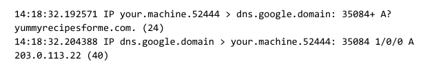
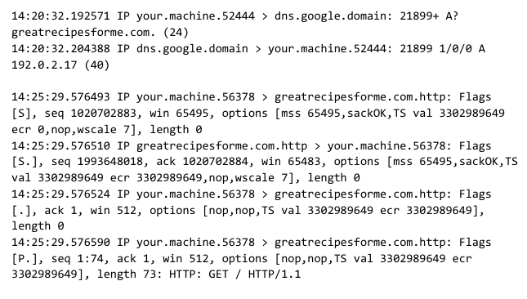

# Security Incident Report: Website Compromise and Malware Redirection

## Section 1: Identify the network protocols involved in the incident 

Based on the `tcpdump` traffic logs and the sandbox investigation, the following network protocols were identified:
* **DNS (Domain Name System):** Identified in the logs when the source computer requests the IP address for the domains (`yummyrecipesforme.com` and the malicious `greatrecipesforme.com`) over port 53.
* **HTTP (Hypertext Transfer Protocol):** Identified when the browser requests the webpage (`GET / HTTP/1.1`) and initiates the download of the malicious executable file over port 80.
* **TCP (Transmission Control Protocol):** Identified by the `Flags [S]` (SYN) and `[.]` (ACK) during the connection handshakes between the client and the web servers.

---

## Section 2: Document the incident

**Incident Summary:**
Customers of *yummyrecipesforme.com* reported that after visiting the website, they were prompted to download a file to access free recipes. Upon execution, the file caused system performance degradation and redirected their browsers to a different website. Simultaneously, the website owner lost access to the administrative panel.

**Investigation Findings:**
* **Attack Vector:** A former employee executed a brute-force attack against the website's administrative login page. The attack was successful because the default administrative password had not been changed, and there were no rate-limiting controls in place.
* **Payload:** Once authenticated, the attacker altered the website's source code, embedding a malicious JavaScript function. This script prompts visitors to download a fake "browser update" executable. Furthermore, the attacker changed the admin password, locking out the legitimate owner.
* **Network Analysis:** Sandbox testing using `tcpdump` confirmed the behavior. The logs show the initial DNS resolution and HTTP connection to `yummyrecipesforme.com` (IP: `203.0.113.22`). After the executable is downloaded and run, the logs show a new DNS request and subsequent HTTP traffic forcefully redirecting the user to the malicious domain `greatrecipesforme.com` (IP: `192.0.2.17`).

---

## Section 3: Recommend one remediation for brute force attacks

**Recommendation: Implement Account Lockout Policies and Disable Default Credentials**

To prevent future brute-force attacks, the organization must implement an **Account Lockout Policy** that limits the number of failed login attempts. For example, after 3 to 5 incorrect password attempts, the account or the originating IP address should be temporarily locked for a set duration (e.g., 30 minutes). 

This measure is highly effective because brute-force attacks rely on rapidly guessing thousands of password combinations. By locking the account after a few attempts, the attack is halted, making it mathematically impractical for a malicious actor to guess the password. 

Additionally, as a mandatory baseline, the system should force administrators to **change default passwords** upon their first login and enforce strong password complexity requirements.

---

## Evidence and Traffic Analysis

### 1. Initial Legitimate Traffic
The `tcpdump` logs initially show the user's machine making a normal DNS request for the legitimate website (`yummyrecipesforme.com`) and receiving the correct IP address (`203.0.113.22`):

### 2. Malicious Redirection
After the payload is executed, the logs show the browser being forced to make a new DNS request for the attacker's domain (`greatrecipesforme.com`). It resolves to a different IP (`192.0.2.17`), followed immediately by new HTTP traffic directed to this malicious server:

### 📎 Attachments
* [Download the full tcpdump traffic log](tcpdump%20registro%20de%20tr%C3%A1fico.pdf)
