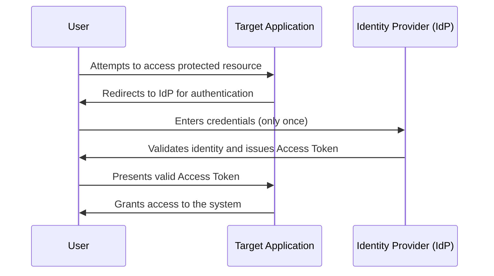

# 🔐 IAM Architecture Guide (Identity and Access Management)

This repository documents the fundamental principles of identity management, access controls, and modern authentication in enterprise environments.

---

## 🛡️ Access Control Fundamentals

Network access control is built upon the **AAA** model:

* **Authentication:** Verifies *who* the user is.
* **Authorization:** Determines *what* the user can do after authenticating.
* **Accounting:** Monitors, logs, and tracks the user's activity within the system.

### Key Organizational Principles

* **Separation of Duties (SoD):** Dividing critical tasks among several people to prevent fraud or errors. For example, in a financial transaction, one employee creates the purchase order, another approves it, and a third pays the invoice.
* **Least Privilege:** Granting users (or applications) only the minimum permissions strictly necessary to perform their current duties, thereby reducing the attack surface.

---

## 🔑 Authentication Factors

To securely verify a user's identity, systems combine multiple factors (MFA). The three universal factors are:

1. **Knowledge:** Something the user *knows* (passwords, PINs, security questions).
2. **Possession:** Something the user *has* (physical token, smartphone, smart card).
3. **Inherence (Characteristic):** Something the user *is* (biometrics, fingerprint, facial recognition).

---

## 🌐 Single Sign-On (SSO) and Federations

SSO is a technology that allows users to authenticate once and access multiple interconnected systems.

* **Main Benefits:** * Simplifies user and password management for the IT team.
  * Provides a better and more seamless experience for the end-user.
* **Main Disadvantage:** If the single set of credentials is stolen, attackers gain immediate access to multiple enterprise resources, making the implementation of MFA alongside SSO critical.
* **Authorization Delegation (OAuth):** To allow applications to securely interact with each other without sharing actual passwords, temporary **Application Programming Interface (API) Tokens** are used.

### Conceptual Flowchart: SSO Authentication

---

## 📊 Access Control Models: RBAC vs. ABAC

| Feature | RBAC (Role-Based Access Control) | ABAC (Attribute-Based Access Control) |
| :--- | :--- | :--- |
| **Core Definition** | Access is granted based on the user's role or job title within the company. | Access is granted by evaluating dynamic characteristics of the user, the environment, and the resource. |
| **Implementation Complexity** | Low to Medium. It is the industry standard and easy to audit. | High. Requires more complex logical policy engines. |
| **Flexibility** | Rigid. (e.g., "Everyone in the 'Accountants' group has access"). | Dynamic and granular. (e.g., "Accountants, only from 9 to 5, and from an internal IP"). |
