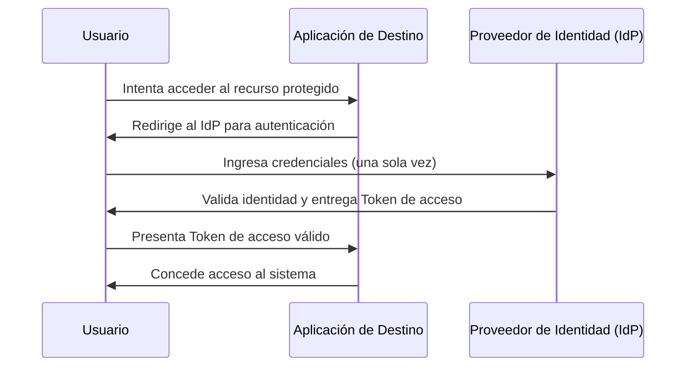

# 🔐 Guía de Arquitectura IAM (Gestión de Identidades y Accesos)

Este repositorio documenta los principios fundamentales de la gestión de identidades, controles de acceso y autenticación moderna en entornos empresariales.

---

## 🛡️ Fundamentos de Control de Acceso

El control de acceso en redes se fundamenta en el modelo **AAA**:

* **Autenticación:** Verifica *quién* es el usuario.
* **Autorización:** Determina *qué* puede hacer el usuario tras autenticarse.
* **Contabilización (Accounting):** Monitoriza y registra la actividad del usuario en el sistema.

### Principios Organizacionales Clave

* **Separación de Funciones (SoD):** Dividir tareas críticas entre varias personas para evitar fraudes o errores. Por ejemplo, en una transacción financiera, un empleado realiza la compra, otro aprueba la transacción y un tercero paga la factura.
* **Privilegio Mínimo:** Otorgar a los usuarios (o aplicaciones) únicamente los permisos estrictamente necesarios para realizar sus labores actuales, reduciendo así la superficie de ataque.

---

## 🔑 Factores de Autenticación

Para verificar la identidad de un usuario de forma segura, los sistemas combinan múltiples factores (MFA). Los tres factores universales son:

1. **Conocimientos:** Algo que el usuario *sabe* (contraseñas, PIN, respuestas de seguridad).
2. **Posesión / Responsabilidad:** Algo que el usuario *tiene* (token físico, smartphone, tarjeta inteligente).
3. **Característica (Inherencia):** Algo que el usuario *es* (biometría, huella dactilar, reconocimiento facial).

---

## 🌐 Inicio de Sesión Único (SSO) y Federaciones

El SSO es una tecnología que permite a los usuarios autenticarse una sola vez y acceder a múltiples sistemas interconectados.

* **Beneficios principales:** * Simplifica la gestión de usuarios y contraseñas para el equipo de TI.
  * Proporciona una mejor y más fluida experiencia al usuario final.
* **Desventaja principal:** Si las credenciales únicas son robadas, los atacantes obtienen acceso inmediato a múltiples recursos empresariales, lo que hace vital la implementación de MFA junto con SSO.
* **Delegación de Autorización (OAuth):** Para permitir que las aplicaciones interactúen entre sí de forma segura sin compartir contraseñas reales, se utilizan **Tokens de interfaz de programación de aplicaciones (API)** temporales.

### Diagrama de Flujo Conceptual: Autenticación SSO

---

## 📊 Modelos de Control de Acceso: RBAC vs. ABAC

| Característica | RBAC (Control Basado en Roles) | ABAC (Control Basado en Atributos) |
| :--- | :--- | :--- |
| **Definición fundamental** | El acceso se otorga basado en el rol o puesto del usuario dentro de la empresa. | El acceso se otorga evaluando características dinámicas del usuario, el entorno y el recurso. |
| **Complejidad de implementación** | Baja a Media. Es el estándar de la industria y fácil de auditar. | Alta. Requiere motores de políticas lógicas más complejos. |
| **Flexibilidad** | Rígida. (Ej. "Todos los del grupo 'Contadores' tienen acceso"). | Dinámica y granular. (Ej. "Contadores, solo de 9 a 5, y desde una IP interna"). |
