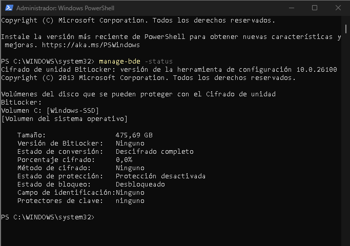
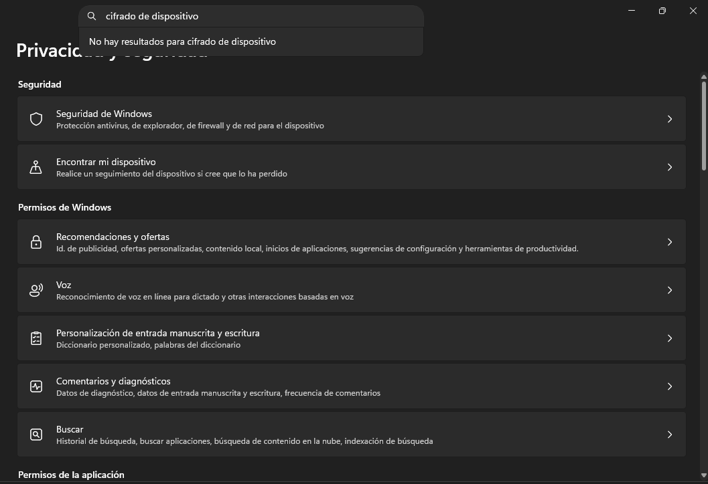
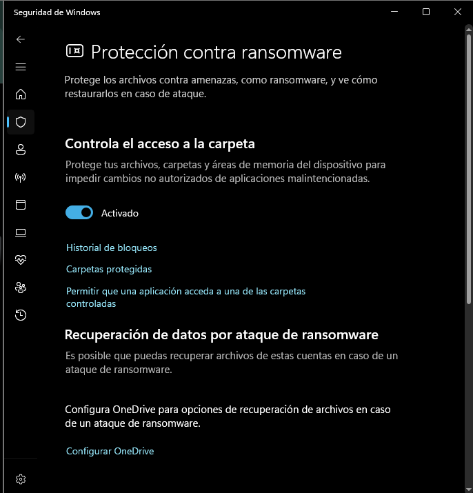

# Windows 11 & WSL Hardening Baseline for Security Operations

## 📌 Project Objective
This repository documents the implementation of a hardening baseline and optimization of a working Endpoint based on Windows 11 and the Windows Subsystem for Linux (WSL). The primary purpose is to audit the host operating system's attack surface, mitigate common risk vectors such as ransomware, and structure a high-performance native Linux environment for network auditing and the deployment of security-applied artificial intelligence models.

---

## 🚀 1. Advanced Linux Environment Optimization (WSL)

To avoid the resource overhead of traditional virtual machines, a native **Ubuntu** instance was deployed in WSL, configuring two critical pillars for performance and auditing:

### Hardware Acceleration (GPU Passthrough)
The existence of the direct graphics bridge device (`/dev/dxg`) was validated. This allows the Linux kernel direct access to the physical graphics card cores. This configuration is vital for accelerating massive data processing and local training of computer vision and machine learning algorithms without saturating the main CPU.

```bash
# Verification of GPU presence in the Linux environment
$ ls -l /dev/dxg
crw-rw-rw- 1 root root 10, 258 Jun 13 14:29 /dev/dxg
```

### Mirrored Network Configuration
By default, WSL isolates the instance in a virtual subnet via NAT, which hinders communication with external hardware during infrastructure audits. To resolve this, a global directive was implemented in the Windows profile via the `.wslconfig` file:

```ini
[wsl2]
networkingMode=mirrored
```

**Result:** The Ubuntu instance shares the host machine's physical IP, enabling direct, bidirectional visibility with IoT devices, embedded systems, and traffic analysis tools on the local network.

---

## 🛡️ 2. Host System Auditing and Hardening (Windows)

### Phase 1: Full Disk Encryption (FDE) Analysis
A forensic audit was performed via the command-line interface (CLI) using the `manage-bde` tool to verify the cryptographic encryption status of the main `C:` volume.

#### Technical Finding:
The command returned a fully decrypted conversion status (0.0% encrypted) and system error `0x8031005a`, confirming a licensing limitation due to the use of a Windows Home edition, coupled with hardware restrictions regarding the support of the Modern Standby (HSTI) standard.


*Figure 1: Forensic report of the C: drive showing the data protector disabled.*


*Figure 2: Absence of the fast encryption feature in the operating system's graphical interface.*

### Phase 2: Ransomware Mitigation and Access Control (Zero Trust)
As a countermeasure to the inability to activate native encryption due to license restrictions, file system security was elevated by implementing a **Controlled folder access** policy through the system's protection engine.

#### Mitigation Action:
This directive applies a Zero Trust approach over critical development directories, documents, and repositories. It strictly and instantly blocks any attempt at modification, writing, or malicious encryption originating from unauthorized processes or scripts in memory.


*Figure 3: Activation of the anti-ransomware shield on the Endpoint's directories.*

---

## 🛠️ Tools Used
* **Windows Subsystem for Linux (WSLg)**: Optimized base operating environment.
* **PowerShell (Administrator)**: Primary CLI for internal policy auditing.
* **Microsoft Windows Defender**: Mitigation and controlled access engine.
* **Visual Studio Code**: Primary editor integrated via native IPC tunnels with the Linux environment.
